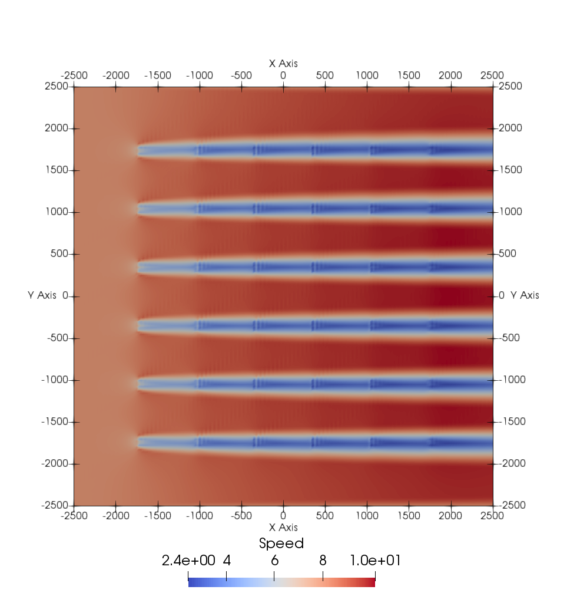

.. _demo_2d_grid:

Gridded Wind Farm on a Rectangular Domain
=========================================

This demonstration will show how to set up a 2D rectangular mesh with a
wind farm consisting of a 36 turbines laid out in a 6x6 grid. This demo is 
associated with two files:
    
    * Parameter File: :download:`params.yaml`
    * Driver File: :download:`2D_Grid_driver.py`

Setting up the parameters:
--------------------------

To write a WindSE driver script, we first need to define the parameters. This
must be completed before building any WindSE objects. There are two way to 
define the parameters:

    1. Loading a parameters yaml file
    2. Manually creating the parameter dictionary directly in the driver. 

Both methods will be discussed below and demonstrated in the next section.

The parameter file:
~~~~~~~~~~~~~~~~~~~

First we will discuss the parameters file method.
The parameter file is the main way to customize a simulation. The driver 
file uses the options specified in the parameters file to run the simulation.
Ideally, multiple simulations can use a single driver file and multiple 
parameter files. 

The parameter file is formated as a `yaml <https://yaml.org/>`_ structure and
requires `pyyaml <https://pyyaml.org/>`_ to be read. The driver file is 
written in python. 

The parameter file is broken up into several sections: general, domain, 
boundaries, and wind_farm, etc. 

The full parameter file can be found here: :download:`params.yaml` and more information can be found here: :ref:`Parameter File Explained <parameter_file>`.

Manual parameter dictionary:
~~~~~~~~~~~~~~~~~~~~~~~~~~~~

The manual method involve creating a blank nested dictionary and populating it with 
the parameters needed for the simulation. The :py:meth:`windse_driver.driver_functions.BlankParameters` 
will create the blank nested dictionary for you. 

Creating the driver code:
-------------------------

The full driver file can be found here: :download:`2D_Grid_driver.py` First, 
we start off with the import statements::

    import windse
    import windse_driver.driver_functions as df

Next, we need to set up the parameters. If we want to load them from a yaml file we would run::

    # windse.initialize("params.yaml")
    # params = windse.windse_parameters

However, in this demo, we will define the parameters manually. Start by creating a blank parameters object::

    params = df.BlankParameters()

Next, populate the general options::

    params["general"]["name"]        = "2D_driver"
    params["general"]["output"]      = ["mesh","initial_guess","turbine_force","solution"]
    params["general"]["output_type"] = "xdmf"

Then, the wind farm options::

    params["wind_farm"]["type"]      = "grid"
    params["wind_farm"]["grid_rows"] = 6
    params["wind_farm"]["grid_cols"] = 6
    params["wind_farm"]["ex_x"]      = [-1800,1800]
    params["wind_farm"]["ex_y"]      = [-1800,1800]
    params["wind_farm"]["HH"]        = 90
    params["wind_farm"]["RD"]        = 126
    params["wind_farm"]["thickness"] = 10
    params["wind_farm"]["yaw"]       = 0
    params["wind_farm"]["axial"]     = 0.33

and the domain options::

    params["domain"]["type"]    = "rectangle"
    params["domain"]["x_range"] = [-2500, 2500]
    params["domain"]["y_range"] = [-2500, 2500]
    params["domain"]["nx"]      = 50
    params["domain"]["ny"]      = 50

Lastly, we just need to define the type of boundary conditons, function space, problem formulation and solver we want::

    params["boundary_conditions"]["vel_profile"] = "uniform"
    params["function_space"]["type"] = "taylor_hood"
    params["problem"]["type"]        = "taylor_hood"
    params["solver"]["type"]         = "steady"

Now that the dictionary is set up, we need to initialize WindSE::

    params = df.Initialize(params)

That was basically the hard part. Now with just a few more commands,
our simulation will be running. First we need to build the domain
and wind farm objects::

    dom, farm = df.BuildDomain(params)

We can inspect the wind farm by running::

    farm.Plot(True)

This results in a wind farm that looks like this:

.. figure:: wind_farm.png
   :scale: 75 %

Alternatively, we could have use ``False`` to generate and save the plot, 
but not display it. This is useful for running batch test or on a HPC. We 
could also manually save the mesh using ``dom.Save()``, but since we 
specified the mesh as an output in the parameters file, this will be done
automatically when we solve.  

Next, we need to setup the simulation problem::

    problem = df.BuildProblem(params,dom,farm)

For this problem we are going to use Taylor-Hood elements, which are
comprised of 2nd order Lagrange elements for velocity and 1st order elements
for pressure. 

The last step is to build the solver::

    solver = df.BuildSolver(params,problem)

This problem has uniform inflow from the west. The east boundary is our outflow and has a no-stress boundary condition.

Finally, it's time to solve::
    
    solver.Solve()

Running ``solver.Solve()`` will save all the inputs according to the 
parameters file, solve the problem, and save the solution. If everything 
went smoothly, the solution for wind speed should be:

